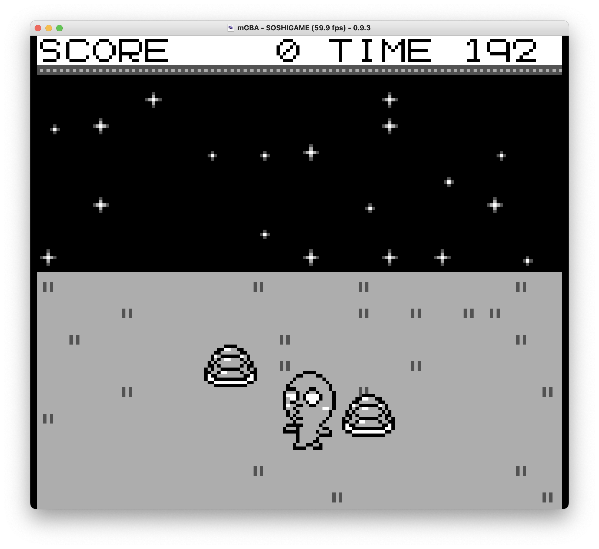

# そしガメ

## ゲーム説明

制限時間内に縦横無尽に動き回るカメをたくさん捕まえるゲームです  
時間が経つにつれてカメの数は増えていき、その分得点もアップします  
構えている(Bボタン押しっぱなし)時にカメに当たると捕まえることができます  
捕まえた状態でBボタンを離すと得点が入ります  
構えていない時やカメを捕まえている時に少しでも他のカメに当たるとゲームオーバーです  

## 操作方法

| ボタン | 内容 |
| :-: |  :- |
| A | ジャンプ |
| B | 押しっぱなし: 構える 離す: 構え解除 |
| ↑ | 上移動 |
| ↓ | 下移動 |
| ← | 左移動 |
| → | 右移動 |

## 使用楽曲

| タイトル | 作曲 |
| :-: | :- |
| うさぎとかめ | 納所弁次郎 |
